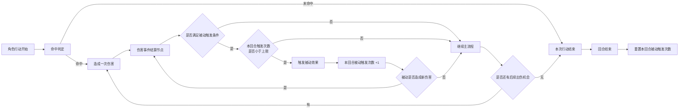

# M98战斗被动触发流程图

## 1. 目标

这份流程图用于解决一个具体问题：

- 玩家在一次行动中可能有很多次出伤机会
- 每次造成伤害时，都要即时判断是否触发被动
- 被动触发存在回合内次数上限
- 被动本身还可能再次造成伤害，从而形成回流

因此，流程图不应按“普攻、连击、追击、反击、DOT”分别展开，而应统一抽象成：

**任意来源的伤害事件 -> 统一进入被动判定模块**

## 2. 绘制原则

- 不按攻击类型分别画被动判断，而按“伤害事件”统一收口
- 被动触发判断独立成一个通用节点
- 回合内触发上限作为单独判断节点，不和触发条件混写
- 如果被动造成新伤害，则回流到“伤害事件结算节点”
- 回合结束时，统一重置“本回合被动触发次数”

## 3. 流程图

## 4. 节点说明

### 4.1 伤害事件结算节点

这个节点是整张图最关键的抽象层。

它的含义是：

- 不管这次伤害来自普攻、技能、连击、追击、反击还是持续伤害
- 只要伤害已经成立
- 就统一进入这个结算节点

这样做的好处是流程图不会因为伤害来源过多而爆炸。

### 4.2 被动触发条件

这一层只判断“这次伤害是否具备触发资格”，例如：

- 是否为指定类型伤害
- 是否命中特定目标
- 是否满足暴击/破甲/属性异常等前提

这里不要混入“次数上限”判断，否则图会变乱。

### 4.3 回合内触发次数上限

这一层单独负责限制频率。

推荐在图中直接写成：

- 本回合触发次数是否小于上限

这样所有人一眼就能看出：

- 满足条件不代表一定触发
- 还要看本回合额度是否用完

### 4.4 被动回流

如果被动效果本身会造成伤害，比如：

- 追加伤害
- 连锁雷击
- 反伤
- 爆炸扩散

那么不要重新从“命中判定”开始画，而是直接回流到：

- 伤害事件结算节点

因为它本质上已经是一次成立的伤害事件。

## 5. 推荐的图面拆法

如果你后续还要继续细化，我建议拆成两层：

### 5.1 主流程图

只保留：

- 造成伤害
- 调用被动判定
- 是否回流
- 是否还有后续出伤机会
- 回合结束重置

这样主图足够清晰。

### 5.2 被动判定子图

单独展开：

- 触发条件
- 次数上限
- 触发效果
- 是否生成二次伤害

这样以后改规则时，不需要重画整张战斗图。

## 6. 结论

这类战斗流程图最重要的不是把所有伤害来源全部铺开，而是先建立统一的事件抽象。

正确的绘制方式是：

**任意出伤来源 -> 统一伤害事件结算 -> 被动判定 -> 次数上限判断 -> 触发效果 -> 如有新伤害则回流**

这样你既能保留“即时判断被动”的设计要求，也能避免因为回合内出伤机会过多，把整张图画得无法维护。
