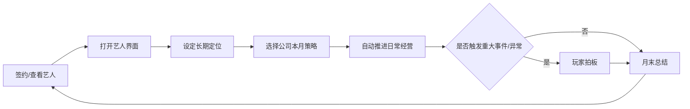

# 勇闯娱乐圈：游戏基础体验设计稿

版本：v1.2  
日期：2026-06-03  
用途：用于讨论游戏基础体验，在玩法定位、主循环、差异化和核心系统达成共识后，再进入具体开发环节。

## 一、核心定位

《勇闯娱乐圈》是一款以“金牌经纪人”为主角视角的娱乐圈题材养成经营游戏。玩家不直接扮演艺人，而是经营一家逐步成长的经纪工作室，签约不同类型的艺人，安排训练、活动、影视、音乐、综艺、商务与公关事务，在机会、风险、舆论和人情关系之间做选择，打造多领域成功艺人。

### 目标体验

玩家体验的核心不是“单纯把属性刷满”，而是：

- 发现有潜力但不完美的艺人。
- 判断艺人的路线、性格、资源匹配度和成长节奏。
- 在有限时间、精力、人脉和舆论压力下安排档期。
- 面对娱乐圈事件时做取舍，例如爆红、塌房、雪藏、转型、绯闻、奖项、合约纠纷。
- 通过多轮经营看到艺人的命运变化，形成“我亲手带出来的艺人”的情感连接。

### 设计基调

游戏应当是“轻经营、强角色、强事件、强结局收集”的养成 SLG，而不是硬核财务模拟器，也不是纯视觉小说。

娱乐圈可以有黑暗面，但基础体验不应走现实残酷路线。项目调性更偏轻喜剧、黑色幽默、爽文逆袭和娱乐圈解构，强调看乐子、爽感、热梗和戏剧化反转。玩家能感受到名利场的荒诞和复杂，但整体体验应保持轻松、可玩、带梗、有爽点。

### 一句话卖点

担任金牌经纪人，从素人、糊咖、练习生和争议艺人中发掘潜力，在训练、资源、舆论和人情博弈中，把他们推向歌坛、影坛、综艺与商业顶峰。

### 主角设定边界

主角经纪人的身份、性格和过往不做自定义。玩家扮演一个固定主角，以统一叙事口吻、剧情节奏和角色关系。后续可以允许玩家选择经营风格，但不通过自定义背景来分散开发与叙事焦点。

## 二、主循环

基础主循环进一步调整为“签约艺人 -> 设定长期定位 -> 选择公司本月策略 -> 自动推进 -> 只处理重大事件/异常 -> 月末总结”。玩家不再像艺人贴身保姆一样逐日逐项安排训练，而是以经纪公司经营者视角做资源方向、预算和风险取舍。

日常成长自动化，情感反馈不自动化。艺人会按长期定位和公司策略自行成长、营业、回款；但重大机会、压力临界、信任变化、恋情/舆论风险、成功或失败节点，必须通过弹窗、手机私信、谈心或专属事件主动找玩家，让玩家仍然感到“这是我带出来的人”。

地图移动、地点解锁和地点项目继续保留，但其定位从高频刷日常转为公司资源版图、特殊行动入口和关键机会来源。玩家可以在地图上移动，选择公司办公室、培训教室、电视台、影视城、唱片公司、粉丝社区等地点；初始只开放少量地点，影视城、唱片公司、电视台等资源地点需要公司资金解锁。

同时必须建立“咖位等级 -> 资源大小 -> 更高层资源解锁”的娱乐圈金字塔。玩家培养艺人的根本目标不是单纯刷属性，而是让艺人从低阶身份一路爬到行业塔尖，从而接触更高等级的综艺、影视、音乐、商务和奖项资源。

需要注意：L1-L5 只作为底层数值，不应作为唯一玩家可见评价。玩家看到的称呼要按路线定制，例如影视路线是“小透明演员、腰部演员、影帝/影后”，音乐路线是“新人歌手、上升歌手、歌王/歌后”，综艺路线是“飞行嘉宾、常驻嘉宾、国民综艺咖”。

娱乐圈金字塔是成长认知入口，但不应长期占据主界面。主界面只保留“查看金字塔/咖位排行”按钮和当前等级摘要；玩家点击后以弹窗查看完整等级排行、当前等级、下一档门槛和奖项目标。

艺人的发展路线不应由初始角色固定。角色可以有初始优势和短板，但最终路线要由玩家选择目标、培养能力、兑现成果来塑造。比如同一个艺人可以通过歌唱比赛积累音乐荣誉，也可以通过影视项目积累演员履历，路线称号应反映玩家做出的选择。

基础流程明确为：

1. 选择初始艺人。
2. 在艺人界面设定长期定位。
3. 选择公司本月策略并确认预算。
4. 自动推进日常经营。
5. 只处理重大事件、异常和情感反馈。
6. 月末总结公司策略成果。

### 单周期流程

1. 独立选择初始艺人  
   游戏开始时进入单独艺人选择界面。玩家可以看到艺人的人设、标签和简述，展开后查看详细属性，再决定签约。该界面不混入地图和经营信息。

2. 艺人管理与长期定位  
   玩家可以签约多个艺人。右下角提供“艺人”入口，点击后打开艺人管理界面，查看已签约艺人、候选池、当前状态和长期定位。长期定位不是本月排班，而是公司对该艺人的培养方向，例如影视突破、音乐唱作、综艺曝光、商业变现、全能试水、放养观察。

3. 公司本月策略  
   玩家每月只确认一次公司级策略，例如冲热度、稳口碑、赚钱回血、培养新人、押宝影视、押宝音乐、控压休整。公司策略会消耗预算，并影响旗下艺人的成长、压力、口碑、热度和回款。策略与艺人长期定位匹配时，成长效率更高；不匹配时也可能产生资源错配和心理压力。

4. 日常自动成长  
   艺人签约并设定长期定位后，日常行动由系统自动推进。长期定位决定艺人默认成长方向，公司策略决定本月经营重心。没有公司策略时，艺人仍会低强度自由行动，但成长、收益和机会都较弱。

5. 重大决策弹窗  
   月度路线推进过程中，会触发重大决策弹窗，例如接短剧主角还是蹲院线配角、接受综艺人设剧本还是拒绝恶剪、接高压商务还是筛选温和合作。玩家只在这些节点拍板，选择必须互斥，并带来长期后果。

6. 地图与地点保留  
   地图地点、地点解锁、学习/通告/公关等设定继续保留，但它们从高频日常点击转为公司资源版图和特殊行动入口。影视城、唱片公司、电视台等地点仍需要公司花费资金解锁，解锁后可影响对应路线机会、项目池和重大事件。

7. 事件与反馈  
   自动成长、重大决策和随机事件根据艺人属性、信任、压力、热度、口碑等触发反馈，例如试镜被看中、热梗翻车、压力爆表、粉丝回暖、狗仔爆料、艺人解约。

8. 手机情报  
   玩家可以通过界面上的手机图标打开经纪人手机，查看本周热搜资讯、娱乐爆料、其他艺人动态、制作人或同行工作室消息。手机界面应作为弹出层存在，点击空白处或关闭按钮退出。手机不只是氛围 UI，而是提示机会、风险、行业风向和八卦隐患的信息入口。

9. 推进时间  
   玩家主动推进时间后，所有已签约艺人按长期定位和公司策略自动成长和回款。系统结算公司资金、运营成本、策略收入、艺人压力和重大事件。随机事件有好有坏，会真实作用于艺人，玩家需要先处理事件，再继续经营。策略周期结束时优先弹出月末总结，不与随机事件同屏叠加。

10. 月末总结  
   公司策略推进满一个月后，弹出月末总结，说明本月策略、公司资金变化、艺人成长、最高声量艺人、重大事件结果和下月经营建议。总结结束后，玩家重新选择下月公司策略。

11. 日历查看  
   界面左上方提供日历按钮。玩家点击后弹出日历界面，可以看到当前周、阶段目标、目标截止周、目标门槛和世界发生的大事。日历负责把抽象时间变成可感知压力，让玩家清楚“还有几周结算”“哪些事情正在发酵”“哪些机会已经发生”。

### 主循环示意

### 基础体验判断标准

Demo 阶段只要能让玩家持续产生以下问题，就说明主循环成立：

- 这名艺人的长期定位应该走影视、音乐、综艺、商业还是放养观察？
- 公司本月应该冲热度、稳口碑、赚钱回血、培养新人，还是押宝某条赛道？
- 这个公司策略本月预算多少，现金流能不能撑住？
- 这个重大机会会牺牲哪条路线，错过后会不会改变艺人生涯？
- 当前咖位能不能接这个资源？差多少才能摸到更高层资源？
- 哪些艺人需要重点照顾，哪些艺人可以放养赚钱？
- 本周突发事件要花钱压下去，还是冒险反向操作？
- 要不要为了短期爆红牺牲口碑？
- 这个角色适合歌手、演员、综艺咖，还是转幕后？
- 精力耗尽前，要不要留一次行动处理信任和粉丝？

## 三、差异化部分

### 经纪人视角

同类养成游戏常以“被培养者”或“家长”视角展开，本项目的差异在于玩家是经纪人。经纪人既不是艺人的主人，也不是纯粹旁观者，而是资源调度者、风险承担者和命运推手。

这个视角天然带来几个独特体验：

- 玩家要平衡艺人个人意愿与商业价值。
- 玩家要承担选择后果，例如艺人离心、粉丝反噬、资源方翻脸、团队信任受损、公司资金见底甚至破产。
- 玩家能同时培养多名艺人，形成“公司生态”。
- 玩家可以走不同职业伦理路线，例如良心经纪人、资本操盘手、流量制造者、行业改革者。
- 玩家可以做灰色甚至不道德的经营选择，但游戏会通过信任、舆论、风险、关系和后续事件给出惩罚或反噬。

### 多路线艺人成长

艺人的成功不只是一种结局。不同艺人应有不同路线上限和代价：

| 路线 | 核心属性 | 主要资源 | 成功形态 | 主要风险 |
|---|---|---|---|---|
| 歌手 | 唱功、创作、舞台、粉丝黏性 | 单曲、专辑、音乐节、演唱会 | 金曲歌手、唱作人、流量歌手 | 作品扑街、现场翻车、粉圈争议 |
| 演员 | 演技、台词、形象、业内口碑 | 试镜、电视剧、电影、话剧 | 影后影帝、剧王主角、实力派配角 | 轧戏、番位争议、演技质疑 |
| 综艺艺人 | 综艺感、情商、反应、路人缘 | 综艺常驻、飞行嘉宾、直播 | 国民综艺咖、主持人、话题王 | 人设崩塌、口误、过度曝光 |
| 商业明星 | 颜值、时尚、粉丝购买力、品牌契合 | 代言、杂志、红毯、直播带货 | 品牌宠儿、商业顶流 | 消费反噬、审美翻车、割韭菜争议 |
| 幕后转型 | 创作、管理、资源、人脉 | 制作人、导演、工作室合伙 | 金牌制作人、导演、老板 | 转型失败、资源流失、团队矛盾 |

### 娱乐圈事件密度

本项目的内容卖点不应只靠数值系统，而要靠高密度事件推动。事件可以分为：

- 成长事件：训练瓶颈、舞台顿悟、表演开窍、创作低谷。
- 资源事件：临时救场、剧组换角、品牌竞标、综艺抢人。
- 舆论事件：绯闻、黑热搜、粉丝冲突、路人盘变化、媒体断章取义。
- 关系事件：艺人之间竞争、合作、嫉妒、扶持、公司内斗。
- 道德事件：潜规则邀约、虚假营销、压榨档期、数据造假、危机甩锅。
- 热梗事件：当下互联网热点、抽象梗、娱乐圈怪现象、粉圈发疯文学、直播事故等，以架空和变体方式融入。

### 经营与叙事结合

经营结果要能反过来改变剧情，而不是经营和剧情两张皮。

例如：

- 如果艺人长期压力过高，可能触发失控、停工或解约事件。
- 如果玩家频繁炒作，短期热度提高，但路人缘与业内口碑下降。
- 如果玩家保护艺人拒绝高风险资源，短期曝光和资源机会可能变少，但信任度提升。
- 如果某艺人爆红，其他艺人可能获得资源溢出，也可能产生不满。

## 四、核心系统

### 1. 艺人系统

艺人是游戏的核心资产，也是主要情感载体。

建议每位艺人由以下维度构成：

- 专业属性：保持 5 个核心能力，玩家可见命名保持大众化和娱乐圈语感；“演艺行业基础能力可跨领域复用”只作为内部设计原则，不直接作为界面命名。
- 市场属性：热度、粉丝量、粉丝黏性、路人缘、商业价值、业内口碑。
- 状态监控：恋爱风险、压力、信任等属于同一类需要持续监督的动态状态，不再混入人格倾向。
- 风险属性：黑料、争议体质、合约隐患、健康隐患、粉圈风险。
- 个性标签：天赋怪、玻璃心、事业脑、恋爱脑、资源咖、社恐、野心家等。
- 路线倾向：歌手、演员、综艺、商业、幕后。
- 人格倾向：用于表达角色底色和行为偏好，不直接等同于恋爱风险、压力或信任报警项。人格倾向会影响事件偏好、成长副作用和违抗方式。

人格倾向必须让玩家看得懂“怎么改变”和“会怎样”：

- 感性：谈心、镜头表现、剧本围读、录制小样、创作型项目会提升感性。高感性能强化表演共情和作品理解，但更容易被关系牵动，触发恋情、情绪波动或创作失控事件。
- 野心：试镜、高阶资源、热梗营业、综艺曝光会提升野心。高野心会让艺人更主动争资源，成长更快；但当信任不足时，艺人更可能绕过经纪人、违抗安排或抢番位。
- 恋爱倾向：镜头表现、感情戏、创作和高感性事件会提升恋爱倾向；体能管理、自律训练和强管理会压低。高恋爱倾向在爱豆、综艺咖、高热度艺人、作品宣传期都可能触发狗仔同框、粉圈反噬、商务犹豫等公关危机。
- 自律：体能管理、路线复盘、粉丝维护、口碑修复会提升自律；过度热梗营业、连轴通告和低信任高压力会降低自律。高自律能降低爽约、夜归、恋情曝光和失控概率；低自律会放大黑热搜、粉丝内讧和塌房风险。
- 现实处境：年龄、资本背景、粉丝结构、当前知名度、粉圈压力、资源门槛和发展难度。

建议专业属性五项：

| 玩家可见属性 | 含义 | 内部通用化原则 | 适用方向 |
|---|---|---|---|
| 唱功 | 声乐、台词、音色、表达清晰度 | 声音表达能力 | 音乐、影视台词、综艺表达、直播 |
| 演技 | 角色理解、情绪层次、镜头信念感 | 表演理解能力 | 影视、短剧、MV、舞台剧情段落 |
| 舞台 | 舞蹈、仪态、镜头体态、动作协调 | 身体与镜头控制 | 舞台、影视动作、时尚、商务大片 |
| 魅力 | 综艺感、临场反应、幽默感、观众缘；由原“综艺”和“魅力”合并 | 观众连接能力 | 综艺、主持、直播、采访、商务沟通 |
| 创作 | 选题、表达、作品理解、二创和内容生产能力 | 内容生成与审美判断 | 音乐创作、影视理解、唱跳编排、综艺内容、短视频营业 |

体能不再作为独立专业属性。体能相关内容可以进入状态、健康、档期耐受或项目副作用，例如高压连轴转导致疲劳、受伤、压力上升。

属性展示建议：

- 默认以“五芒星图”的形式展示 5 个专业属性，让玩家一眼看到艺人的能力轮廓。
- 提供“五芒星图 / 柱状图”切换按钮。五芒星图看能力形状和偏科程度，柱状图看具体数值、变化来源和项目门槛。
- 五芒星图只用于专业属性，不把市场、状态、人格混入同一张图，避免玩家误读。
- 五芒星图必须放在角色属性栏的靠前位置，避免被人格、荣誉、市场等信息挤到下方导致玩家看不到。

艺人不能只是数值不同，还要在事件选择上表现出差异。同一选择对不同艺人应有不同后果。

艺人培养的两面性：

- 培养感性会提升作品理解、创作表达和表演细腻度，但也可能提高恋爱、私生活外溢、狗仔偷拍和情绪化决策风险。
- 培养野心会提高冲资源、争番位和抓机会的积极性，但可能增加压力、竞品冲突和团队控制难度。
- 培养自律会降低塌房和失控风险，但可能压制即兴表达、松弛感和热梗爆发。
- 年龄与粉丝结构会改变八卦后果。年轻养成系艺人恋爱风险更高；成熟艺人则更容易被卷入婚姻、家庭、转型、年龄焦虑等舆论议题。
- 资本支持度会影响咖位判断、资源拒绝概率和目标池。高资本角色可以更早接触 S 级主演、头部商务等高阶目标，但必须承担资源咖争议和口碑反噬。

### 2. 候选池与签约系统

初始艺人不是固定 3 人，而是从候选池中选择。开局只能签约 1 位艺人，玩家先围绕单个艺人建立基础体验，随后随着公司经营扩大，逐渐解锁更多候选艺人和签约名额。

角色展示需要加入“市场定位”。市场定位不是固定路线，而是行业对该艺人的初始看法和最快打开局面的方式。例如：

- 舞台萌新：适合先补唱功、舞台和综艺试录，用低成本曝光积累第一批粉丝。
- 低热度口碑演员：适合影视城围读、试镜、配角邀约，通过作品履历打响知名度。
- 热梗型新人：适合电视台、粉丝社区和营业活动，但需要警惕自律低、口碑反噬和黑红路线失控。
- 唱作口碑苗子：适合唱片公司小样、制作人会面、OST 试唱，用作品和口碑慢慢兑现。
- 资本资源咖：资本能提前打开高阶资源，但必须用作品和表演质量洗掉“只靠背景”的逆反。
- 高粉爱豆：商务和综艺回款强，但恋爱、夜归、同框、粉圈内讧都会被放大成公关危机。

市场定位要显示在角色卡和角色状态栏中，并给出推荐成长方式，让玩家知道“这个角色为什么适合先去某个地点”。

候选池设计重点：

- 每位候选艺人要有清晰卖点、短板和路线潜力。
- 初始选择应形成明显分支，例如天赋强但难管、属性均衡但上限未知、黑料较多但自带热度。
- 后续扩张应让玩家感到“公司变大了”，而不是简单增加管理负担。
- 新艺人加入后，应引入艺人与艺人之间的竞争、合作和资源分配矛盾。

### 3. 模拟经营与月度规划系统

当前体验反馈显示，高频日常养成选择容易变得繁琐且不够爽。后续主方向改为“多艺人签约 + 月度路线规划 + 自动成长 + 重大决策介入”的模拟经营体验。

基础规则：

- 玩家可以签约多个艺人。
- 右下角提供“艺人”按钮，打开艺人管理界面。
- 签约艺人后，玩家为其选择未来一个月的发展路线，例如影视演艺月、音乐唱作月、综艺舞台月、商业营业月。
- 选择路线前必须显示本月预算、自动成长方向、预期每周回款和风险提示。
- 确认路线后立即扣除本月规划资金。
- 后续每周推进时，艺人按路线自动获得专业属性、市场属性、压力、信任和资金回款。
- 路线推进过程中触发重大决策弹窗，玩家只在关键节点介入。
- 未规划路线的艺人可自由行动，但成长和回款较弱。

设计目标：

- 减少玩家重复点击日常项目的负担。
- 强化经纪公司经营多名艺人的感受。
- 把玩家选择集中到职业路线、资源取舍、危机处理和重大机会。
- 让每次选择都更像“拍板艺人命运”，而不是排每日课程表。

### 3.1 地图行动与精力系统

地图行动与精力系统承载玩家的主要决策。Demo 阶段不采用简单日历排班，而是让玩家带艺人在地图上移动，到不同地点选择项目进行成长。

时间系统需要有具象入口。界面左上方放置日历按钮，点击打开日历弹窗。日历不是装饰 UI，而是目标管理和世界事件回顾入口。

基础规则：

- 地图移动不消耗精力。
- 地图地点不应全部初始开放。开局开放公司办公室、培训教室和粉丝社区，让玩家先完成基础经营、能力培养和粉丝维护。
- 影视城、唱片公司、电视台等资源地点需要公司花费资金解锁。玩家点击未解锁地点时，先弹出“解锁地点/花费”确认窗口，确认后扣除资金、开放地点，并进入该地点查看项目。
- 地点项目消耗精力。
- 精力不足时无法执行项目。
- 精力耗尽后只能推进时间。
- 推进到下一周后恢复精力，并进行压力、舆论、目标、随机事件和公司资金等周期结算。资金归零则公司破产，游戏结束。
- 日历界面显示当前周、活动目标、截止周、世界大事和近期工作室记录，用来强化时间压迫感。

地点项目类型：

- 培训类：提升唱功、演技、舞台、魅力、创作等专业属性。
- 资源类：试镜、录制小样、综艺试录，带来热度、粉丝和路线机会。
- 关系类：经纪人谈心、制作人会面、粉丝维护，影响信任、口碑和压力。
- 舆论类：热梗营业、口碑修复、公关处理，制造短期与长期取舍。

地点解锁的设计目的：

- 用公司资金体现“经纪公司扩张资源版图”的经营感。
- 让玩家在早期感到影视、音乐、电视资源入口稀缺，而不是一开始就面对全娱乐圈；粉丝社区作为基础运营阵地可初始开放。
- 把影视城、电视台、唱片公司这类关键地点变成阶段性目标，玩家需要权衡“先培养艺人”还是“先扩张资源入口”。
- 未解锁地点可以在地图上显示，但必须带有费用提示，点击后走弹窗确认，不应直接进入项目列表。

设计重点：

- 精力必须稀缺。
- 地点选择要有路线暗示。
- 项目要有即时反馈。
- 玩家应感到“我带艺人在城市里跑资源”，而不是只在表格里排班。
- 休息和谈心类项目要有价值，否则玩家会一直选择高收益项目。

### 4. 资源项目系统

为了控制开发规模，音乐、影视、综艺、商务不建议各自做完全独立系统，而应共用一套“资源项目系统”。

每个资源项目包含：

- 类型：单曲、专辑、电视剧、电影、综艺、代言、直播、杂志。
- 资源等级：基础资源、小透明资源、上升期资源、当红资源、顶流资源。
- 咖位门槛：艺人未达到对应咖位时仍可尝试高阶项目，但会大概率被资源方拒绝；拒绝应消耗少量精力并带来压力、信任、口碑等反馈。
- 门槛：属性、人脉、热度、口碑、特定标签。
- 收益：热度、粉丝、口碑、奖项潜力、人脉、路径关键事项、当周回款加成。
- 成本：培训、谈判、公关、录制和高阶资源尝试会消耗公司资金。营业、商务、综艺曝光和可变现通告会提高当周回款。
- 风险：压力、黑粉、舆论争议、档期冲突、失败惩罚。
- 适配度：与艺人路线、形象、属性、当前舆情相关。

项目结果不应只有成功或失败，而应有更细的反馈：

- 商业成功但口碑差。
- 口碑好但没热度。
- 热度爆炸但争议大。
- 小范围成功，为后续高阶资源铺路。
- 失败但让艺人获得成长。

### 5. 咖位金字塔系统

咖位金字塔是成长体系的核心。没有它，玩家只是在地图上刷属性；有了它，玩家才会明确知道“为什么要培养、培养到哪里、下一层资源是什么”。

界面呈现上，金字塔采用“按钮入口 + 弹窗详情”。主界面不在艺人状态栏重复显示咖位摘要；完整 L1-L5 排行、奖项目标和资源说明放入弹窗，避免主流程界面被长期占用。

咖位弹窗必须先提供领域标签，而不是直接自动展示某一条路线。建议至少包含：

- 影视演艺
- 音乐唱作
- 综艺舞台
- 商业热度

玩家点击领域标签后，进入对应领域的序列等级金字塔。每个序列都需要显示当前领域称号、L1-L5 等级、奖项目标、关键事项进度和下一档门槛。系统可以默认选中当前主路线，但必须让玩家明确看到“当前正在查看哪个领域”，并允许自由切换。

系统分为两层：

- 底层咖位值：统一计算资源门槛和成长层级。
- 路线评级称呼：根据艺人的主路线，把底层等级翻译成行业称号和奖项目标。

底层建议初版采用 5 层：

| 等级 | 咖位 | 对应资源 | 玩家目标 |
|---|---|---|---|
| L1 | 素人 / 练习生 | 基础训练、内部沟通、粉丝维护 | 建立基础能力和路线方向 |
| L2 | 小透明 | 试录、小样、普通试镜、低门槛曝光 | 获得第一批公开反馈 |
| L3 | 上升期 | 制作人会面、配角机会、稳定商务 | 形成可持续路线 |
| L4 | 当红艺人 | 黄金档综艺、重点角色、正式作品企划 | 冲击大众认知和商业价值 |
| L5 | 顶流 / 影歌双栖 | S 级主角、头部代言、奖项资源 | 进入塔尖资源竞争 |

咖位值可由热度、粉丝和口碑共同决定。高热度但低口碑可以冲上去，但风险更大；稳口碑路线会慢一些，但高阶资源更稳。

咖位提升采用双条件：

- 基础咖位值：由热度、粉丝、口碑、资本背景和荣誉等决定，表示“行业是否开始看见你”。
- 路径关键事项：由具体成果触发，表示“行业为什么承认你”。例如影视路线需要试镜、短片、剧集或主演局成果；音乐路线需要小样、制作人会面、EP 或比赛成果；综艺路线需要试录、热梗出圈、黄金档综艺；商业路线需要粉丝转化、品牌合作和口碑修复。

数值达到下一档只代表具备升咖资格。如果缺少路径关键事项，艺人会卡在当前咖位，直到真正出现作品、舞台、综艺或商务成果。

咖位提升还应反作用于地图项目。地点不是静态项目列表：当艺人咖位提升后，影视城、电视台、唱片公司、粉丝社区等地点需要出现更高性价比的项目，例如平台配角邀约、OST 试唱、黄金档通告、品牌短约等。这样玩家能感到“咖位提高后，行业真的开始主动给好价资源”。

路线化展示示例：

| 底层等级 | 影视路线 | 音乐路线 | 综艺路线 | 商业路线 |
|---|---|---|---|---|
| L1 | 表演新人 | 音乐新人 | 通告新人 | 商务试水 |
| L2 | 小透明演员 | 新人歌手 | 飞行嘉宾 | 带货新面孔 |
| L3 | 腰部演员 | 上升歌手 / 唱作人 | 常驻嘉宾 | 品牌合作艺人 |
| L4 | 一线演员 | 一线歌手 | 头部综艺咖 | 品牌宠儿 |
| L5 | 影帝 / 影后 / 视帝 / 视后 | 歌王 / 歌后 / 金牌唱作人 | 国民综艺咖 / 主持核心 | 商业顶流 |

奖项结构参考现实娱乐圈规则：影视可参考电影三大奖和剧集三大奖的新人、配角、主角、作品奖结构；音乐可参考金曲类奖项的新人、年度歌曲、年度专辑、最佳歌手、创作类奖项；商业路线可参考品牌榜、热搜榜、带货榜、商业价值榜。正式游戏是否使用真实奖项名称，后续需要单独确认合规和授权风险。

### 6. 阶段目标与兑现系统

阶段目标用于验证养成是否有效。玩家不是无限刷属性，而是在一段时间内选择一个明确目标，然后围绕门槛进行训练、跑资源和处理事件，到期后结算成败。

初版目标示例：

| 目标 | 对应路线 | 期限 | 核心门槛 | 成功结果 |
|---|---|---|---|---|
| 市级歌唱大赛 | 音乐 | 3 周 | 唱功、创作 | 获得音乐荣誉，提升热度、粉丝和口碑 |
| XX市影视短片项目 | 影视 | 3 周 | 演技、创作 | 获得影视履历，提升口碑和演员路线评级 |
| 新人综艺试录 | 综艺 | 2 周 | 魅力、舞台 | 获得综艺机会，提升热度和粉丝 |
| 城市品牌推广 | 商业 | 2 周 | 热度、粉丝、魅力 | 获得商业荣誉、粉丝转化和路径关键事项 |
| 本轮先躺平 | 无目标 | 2 周 | 无硬性门槛 | 不获得路线荣誉，但修复压力、信任和少量口碑 |

目标规则：

- 每轮提供多个目标，玩家主动选择。
- 目标池必须包含“无发展目标 / 躺平”选项，允许玩家不追逐明确荣誉，但要承担成长放缓或机会流失。
- 目标有期限，到期自动验证。
- 验证看能力、市场状态或心理状态是否过关。
- 成功获得对应领域荣誉，荣誉会反过来影响咖位值、路线称号和资源解锁。
- 番位提升必须弹窗提示，让玩家明确感受到等级、称号、奖项目标和资源待遇的跃迁。
- 失败也会产生反馈，例如压力上升、口碑下降、信任降低或只获得少量曝光。

### 7. 舆论系统

娱乐圈题材必须有舆论系统，但整体感受应偏戏剧化、可控、夸张和带梗，不做现实残酷向体验。早期不宜过于复杂，建议先做五个核心指标：

- 热度：决定曝光和邀约数量。
- 口碑：决定长期资源和奖项机会。
- 粉丝：决定商业价值和抗风险能力。
- 黑粉：决定负面事件放大概率。
- 风险：决定塌房、争议、危机爆发概率。

舆论系统的关键是制造短期与长期的冲突：

- 炒作提高热度，但增加黑粉和风险。
- 高质量作品提高口碑，但周期长、见效慢。
- 商务变现带来曝光、粉丝转化、品牌价值和资金回款，但可能损伤路人缘。
- 道歉能降低风险，但可能损害粉丝黏性。

### 8. 探索地图系统

地图探索采用节点式地点选择。每个地点对应不同项目池、事件池和关系对象。玩家可以在地图上移动并查看项目；项目执行才消耗精力。

初版地点建议：

| 地点 | 主要功能 | 典型事件 |
|---|---|---|
| 公司办公室 | 合同、路线、艺人沟通 | 艺人谈心、团队争执、合约选择 |
| 培训教室 | 属性训练 | 瓶颈突破、老师评价、训练受伤 |
| 电视台 | 综艺和曝光 | 临时救场、主持人口误、镜头争夺 |
| 影视城 | 试镜和剧组 | 换角、压番、导演赏识、剧组矛盾 |
| 唱片公司 | 音乐资源 | 选歌、录音棚状态、制作人合作 |
| 品牌中心 | 商务代言 | 品牌竞标、竞品冲突、直播翻车 |
| 酒会 | 人脉和隐藏资源 | 资本引荐、潜规则、贵人相助 |
| 粉丝社区 | 舆论观察 | 粉圈冲突、站姐爆料、路人反馈 |

### 9. 关系与信任系统

关系系统分为两层：

- 玩家与艺人的信任关系。
- 艺人与行业角色、其他艺人的关系。
- 艺人与艺人之间的竞争、合作和资源争夺关系。

基础关系对象：

- 艺人本人。
- 其他签约艺人。
- 导演、制作人、编剧、音乐人、综艺制片、品牌负责人。
- 媒体、狗仔、粉丝组织、资本方。

关系不只用于解锁剧情，也要影响资源。例如某导演信任玩家后，会优先给试镜机会；某媒体关系差时，负面事件更容易扩散。

信任度是艺人是否服从玩家安排的关键指标。特定情况下，艺人会违抗玩家安排，例如拒绝高压档期、私自恋爱官宣、临时退出项目、主动接触外部资源或要求改变路线。违抗不应只是惩罚，也可以成为角色塑造和剧情爆点。

### 10. 每周随机事件系统

每周推进后触发随机事件，增强不确定性。事件需要有好有坏，并真实作用于艺人，不只是文本气氛。

事件类型：

- 舆论负面：黑热搜、断章取义、粉丝内讧。
- 机会正面：制作人点名、片段出圈、导演临时邀约。
- 状态波动：艺人疲惫、临时emo、粉丝反馈异常。
- 资源变化：项目换人、临时救场、品牌方犹豫。

事件处理原则：

- 玩家必须先处理待解决事件，才能继续做地图项目。
- 随机事件以弹窗形式出现，不能作为普通卡片混在地图主界面里。
- 随机事件处理后必须给出结果反馈，说明玩家选择造成的变化，例如精力、热度、粉丝、口碑、压力或信任变化。
- 每个事件至少提供 2 个处理选项。
- 处理选项消耗不同资源，例如精力、热度或信任。
- 处理结果直接改变艺人的属性、市场状态或心理状态。
- 好事件也要有取舍，例如趁热打铁会消耗精力，稳住节奏会损失热度窗口。

### 11. 手机系统

手机系统是玩家理解娱乐圈信息差的入口，初版可包含两个频道：

- 热搜资讯：展示本周行业风向、爆料号标题、粉圈争议、竞品动态和热梗窗口。
- 业内消息：展示制作人、导演、品牌方、其他艺人工作室或公司同事发来的消息。
- 艺人私信：展示签约艺人对经纪人安排的即时情感反馈，尤其是事业目标、资源试探、被拒绝、舆论事件处理后的反应。

手机信息的作用：

- 提醒玩家本周适合冲曝光、修口碑、避恋情风险还是抢资源。
- 暗示高阶项目的真实门槛，例如番位、人脉、资本背景、粉丝购买力。
- 为后续事件埋钩子，例如狗仔跟拍、制作人试探合作、同行粉丝开战。
- 强化轻喜剧和黑色幽默调性，让玩家感到自己真的在刷娱乐圈消息流。
- 传达艺人对经纪人的依附关系：玩家既是经纪人，也是资源和资本入口，可以捧红、压资源或雪藏艺人；艺人会在手机里表达信任、讨好、戒备、不安和被安排后的心理波动。

手机 UI 原则：

- 手机以图标形式常驻在界面中，而不是占据主流程区域。
- 手机图标需要足够醒目，方便玩家随时查看行业情报。
- 有未读热搜、联系人消息或周更资讯时，手机图标显示红色感叹号；玩家打开手机后清除未读状态。
- 点击手机图标打开手机界面。
- 手机界面内可切换热搜和联系人消息。
- 点击手机外的空白区域或关闭按钮即可关闭。
- 联系人消息中，艺人私信的语气由信任度驱动：高信任偏托付和共谋，中信任偏试探和配合，低信任偏恐惧、戒备和“被经纪人掌握命运”的依附感。

### 11.1 右下角工具入口

为了让主界面更接近养成游戏的操作感，日历、手机、排行统一收束为右下角工具按钮：

- 日历：打开时间界面，查看活动目标、截止周和世界大事。
- 手机：打开热搜与联系人信息，承载艺人私信、制作人消息和行业情报。
- 排行：打开娱乐圈金字塔，查看咖位等级、下一档门槛和奖项目标。

主界面只展示必要摘要，不把工具型按钮分散在顶栏或主流程卡片里。这样玩家的主要注意力留在地图行动、艺人状态和项目选择上。

### 11.2 地图界面信息层级

地图界面需要突出“行动资源”和“当前目标”，弱化常驻说明文字：

- 地点移动反馈以屏幕中央飘字出现，并在短时间内渐隐消失，不放在页面上方形成常驻提示条。
- 地图地点 hover 需要稳定，不能因全局按钮动效导致地点标签大幅偏移。
- 当前阶段目标是玩家本轮行动的核心约束，需要使用更强对比色、截止周标签和门槛进度强化目标感。
- 娱乐圈金字塔不在主流程中显示摘要模块，只保留右下角“排行”工具入口。
- 本周精力显示在地图左上角，让玩家在看地图时直接理解还能做多少行动；顶栏不重复显示精力。
- 专业属性区域只展示专业能力图表，不混入表达不清晰的路线荣誉小格；荣誉和履历后续应独立成模块。

### 12. 对话反馈系统

玩家执行地点项目后，除了数值变化，还应收到对应负责人的反馈，例如演员导师、制作人、综艺导演、总制片、公关负责人、粉丝运营等。

反馈目标：

- 让每次行动更像真实娱乐圈互动，而不是单纯刷数值。
- 用黑色幽默表现行业荒诞，例如资源方话术、甲方审美、粉圈压力和公关疲惫。
- 为后续角色关系、制作人好感、导师评价等系统预留接口。
- 项目执行后的反馈必须以弹出对话框呈现，显示项目名、地点、负责人、反馈文本和剩余精力，不能只依赖顶部事件提示。

### 13. 初始艺人模板扩展

初始候选池需要体现“同样是艺人，但开局资源、发展难度和风险完全不同”。

| 模板 | 核心优势 | 核心风险 | 设计目的 |
|---|---|---|---|
| 京圈公主 | 资本背景强、人脉多、容易打开高阶资源 | 路人逆反、资源咖争议、作品撑不住会被群嘲 | 验证“资源多但口碑难”的成长路径 |
| 当红养成系男团成员 | 高热度、高粉丝量、商务和综艺主动靠近 | 粉圈高压、恋情雷区、转型焦虑、私生活风险 | 验证“起点高但规则严”的经营压力 |

### 14. 恋爱与亲密关系系统边界

游戏允许艺人恋爱、暧昧、分手、官宣、被拍、粉丝反应和公关处理。这部分内容服务于角色关系、舆论系统和娱乐圈事件，不做色情向表达。

设计边界：

- 可以有恋爱关系、官宣、绯闻、CP 营销和情感抉择。
- 不以色情内容作为卖点。
- 恋爱会影响粉丝、热度、口碑、信任、压力和路线选择。
- 玩家可以选择保护、反对、利用或公关处理恋爱关系，但要承担后果。

### 15. 公司经营系统

公司经营是外层压力，不宜过重。建议初版只保留：

- 声誉：影响资源方信任。
- 人脉：影响资源池质量。
- 团队能力：宣传、公关、法务、训练、商务。

公司经营的目标是给艺人养成制造约束，而不是让玩家陷入财务表格。当前 Demo 重新引入资金资源，作为轻量但明确的生死线。

基础资金循环：

- 公司有初始资金。
- 签约艺人需要支付签约费，签约费取决于艺人的热度、粉丝、资本背景和市场位置。
- 解锁地图资源地点需要支付扩张成本。影视城、唱片公司、电视台等地点不是开局全部可用，而是公司投入资金后逐步开放。
- 培训类、谈判类、公关类、作品筹备类项目会消耗资金。
- 艺人签约后每周产生基础回款，回款取决于热度、粉丝、口碑和咖位。
- 当周完成营业、综艺、商务、可变现作品机会时，会提高本周回款。
- 每周会扣除公司运营成本，运营成本可随咖位、团队规模或压力管理成本上升。
- 资金归零则公司破产，游戏结束。

界面呈现：

- 公司资金固定放在页面右上角，而不是占据地图精力卡。
- 公司资金不在右侧艺人状态栏重复显示。
- 玩家点击公司资金按钮，弹出资金详情界面。
- 资金详情至少展示当前库存资金、即将回款资金、艺人基础收入、当周营业加成、预计运营成本和预计净变化。
- 艺人收入需要解释来源，例如热度、粉丝、口碑、咖位和当周营业活动。

压力与合约风险：

- 当艺人压力过高、信任过低时，可能触发“艺人提出解约”事件。
- 当压力和信任进一步恶化，可能触发“艺人对簿公堂”事件，控诉公司压榨、拖欠分成或侵犯休息权，并要求赔偿。
- 这类事件需要对资金、口碑、信任、压力造成明确影响。处理不当时，可以提前结束本轮。

首个阶段不引入外部经纪公司竞争对手，先聚焦内部经营、艺人培养、资源分配、艺人与艺人之间的竞争和团队扩张。

### 16. 结局系统

结局建议分为三类：

- 艺人结局：歌后、影帝、综艺天王、商业顶流、过气、隐退、转幕后、解约、自毁。
- 公司结局：金牌经纪公司、流量工厂、良心小公司、资本附庸、破产清算。
- 玩家结局：行业传奇、争议操盘手、被艺人背刺、守住底线、名利双收。

结局条件应由长期行为塑造，而不是最后一次选择决定。

Demo 暂定完成 5 轮阶段目标选择与结算后解锁结局。结局界面需要总结：

- 玩家经纪人事业评价。
- 艺人生涯阶段与最终市场定位。
- 最终咖位、主发展路线、最高荣誉。
- 公司资金与经营状态。
- 本轮游戏结束，玩家可重开验证不同路线。

## 五、首个 Demo 建议范围

为避免项目失控，首个可玩 Demo 建议控制在以下范围：

- 游戏时长：游戏内 1 年，现实游玩 60 到 120 分钟。
- 艺人数量：候选池提供多名候选艺人，开局只能签约 1 位；Demo 中后段可解锁第 2 位艺人或预告扩张机制。
- 地图地点：6 到 8 个。
- 资源项目：20 到 30 个。
- 咖位等级：至少 5 层，并明确每层可接资源。
- 阶段目标：每轮从若干目标中选择 1 个，到期验证能力是否过关。
- 躺平目标：每轮允许选择无发展目标，修复状态但不获得路线荣誉。
- 随机事件：每周触发 1 个待解决事件，至少包含正面和负面事件。
- 事件数量：50 到 80 个。
- 结局数量：6 到 10 个。
- 手机系统：显示本周热搜资讯与业内消息，作为机会和风险提示。
- 对话反馈：地点项目执行后给出对应负责人的黑色幽默反馈。
- 核心系统：艺人、候选池、地图行动、精力条、手机情报、咖位金字塔、资源门槛、随机事件、戏剧化舆论、信任关系、公司资金和破产条件。
- 开发目标：先做本地原型验证基础体验，长期目标是 Steam PC。

### Demo 目标

Demo 不追求系统完整，而要验证三件事：

1. 玩家是否能理解“地图地点 + 精力消耗 + 项目成长”的乐趣。
2. 玩家是否会对艺人产生情感投入。
3. 玩家是否愿意为了不同路线和结局重玩。

### Demo 验证与版本规则

- 本地原型页面需要显示当前版本号，方便确认玩家看到的是不是最新代码。
- CSS/JS 引用使用版本参数规避浏览器缓存，避免出现“代码已改但页面仍是旧 UI”的误判。
- 未明确要求打包时，不主动生成新版 dist/zip；历史 dist 包只代表打包当时的状态，不代表当前可玩的最新 Demo。
- 排查 UI 与预期不一致时，优先检查页面来源、顶部版本号、浏览器缓存和是否打开了旧打包目录。

## 六、已确认方向

- 主角经纪人的身份、性格和过往不可自定义。
- 初始艺人从候选池中选择，但开局只能签约 1 位。
- 后续随着经营扩大，逐渐开放更多艺人候选和签约名额。
- 游戏调性偏轻喜剧、黑色幽默、爽文逆袭、娱乐圈解构、看乐子和热梗融合，不做现实残酷向。
- 玩家可以做不道德或灰色经营选择，但游戏内需要有惩罚、反噬或长期代价。
- 存在恋爱和亲密关系内容，允许艺人恋爱和官宣，但整体尺度不偏色情向。
- 舆论系统偏戏剧化和可控，不追求现实残酷感。
- 艺人在特定情况下会违抗玩家安排，信任度是关键触发条件之一。
- 公司阶段先不引入外部竞争对手，优先聚焦内部经营和艺人与艺人之间的竞争。
- 首个 Demo 先做本地原型，长期目标是 Steam PC。
- Web Demo 优先验证地图行动、精力条、地点项目和艺人即时成长，不做简单日历排班。
- 咖位等级和资源大小的金字塔关系是核心成长体系，必须在 Demo 中清晰呈现。
- L1-L5 只是底层，玩家可见评价必须按路线定制称号和奖项目标。
- 艺人发展路线不能由初始设定固定，应由玩家选择阶段目标、培养能力并兑现成果来塑造。
- 阶段目标是验证空间，每隔一段时间给玩家明确短期目标。
- 每周随机事件需要真实改变艺人状态，并要求玩家处理。
- 目标选择必须支持“无发展目标 / 躺平”。
- 番位提升后必须弹出提示窗口。
- 地图高阶项目允许低番位尝试，但应以高拒绝率和“看人下菜碟”反馈强化娱乐圈势利感。
- 新增手机系统，用于查看热搜资讯和制作人、同行、其他艺人的消息。
- 手机应以图标形式打开弹窗界面，不应作为常驻主流程信息块。
- 手机有未读资讯时，应通过红色感叹号做强提醒，打开手机后清除未读状态。
- 艺人培养要体现两面性：感性、野心、恋爱倾向、自律等人格维度会带来成长收益和八卦风险。
- 初始艺人池加入京圈公主、当红养成系男团成员等高差异模板，突出知名度、资本背景、粉丝量对资源与难度的影响。
- 资本支持度要真实影响高阶资源和目标池，但会带来资源咖争议、舆论反噬等代价。
- 地点项目需要对话反馈，让制作人、导师、导演、公关等负责人给出更有黑色幽默的即时评价。
- 地点项目的结果反馈需要弹窗化，避免重要反馈只出现在顶部提示里。

## 七、待讨论问题

进入开发前，建议继续讨论以下问题：

- 固定主角的姓名、性别、年龄、过往经历和人物口吻是什么？
- 初始候选池第一批应该有几名艺人？建议 3 到 5 名。
- 开局首签 1 位艺人后，多久解锁第 2 位艺人最合适？
- 每周精力上限应该是多少？不同艺人是否有不同精力上限或恢复速度？
- 轻喜剧和黑色幽默的尺度边界是什么？哪些现实热点可以借梗，哪些不碰？
- 不道德选择的惩罚应偏即时反馈，还是偏长期反噬？
- 艺人恋爱官宣是否允许玩家完全禁止，还是只能劝阻和公关？
- 信任度低到什么程度会触发违抗？违抗后是否可修复？
- 艺人与艺人之间的竞争主要体现为资源争夺、粉丝冲突、路线重叠，还是剧情关系？

## 八、当前共识

- 先讨论基础体验，再进入游戏开发。
- 项目核心不是“娱乐圈百科模拟”，而是“经纪人视角的角色养成经营”。
- 初期必须克制系统范围，用共享的资源项目系统承载音乐、影视、综艺、商务。
- 艺人差异和事件质量比纯数值复杂度更重要。
- 调性优先轻松、解构、热梗和爽感，避免做成沉重现实主义模拟。
